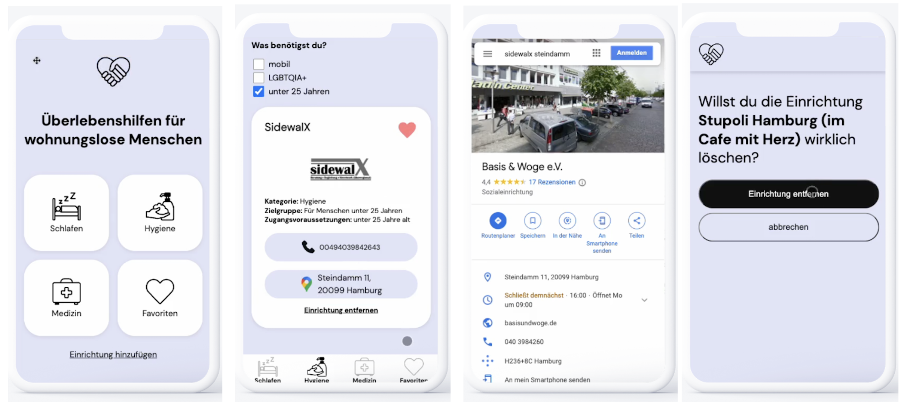

# Überlebenshilfen für wohnungslose Menschen

## Description

**Überlebenshilfen für wohnungslose Menschen** is an app which informs about offers of social institutions so that people in need can find appropriate support easily.

With the help of my app, people can search specifically for offers of help that meet their needs. Likewise, social institutions have the opportunity to inform about their offers.

 This app is the result of my Web Development Bootcamp at neuefische which I attended in late 2022.

 This app is optimized for mobile usage, so please set your browser to mobile version.

## Deployment

You can have a look at the current state of my application hosted on Vercel: [Überlebenshilfen für wohnunglose Menschen](https://ueberlebenshilfen.vercel.app/)

## Tech Stack

- React
- React Hooks
- Styled Components
- Cloudinary
- Next.js
- Node.js
- Jest
- React Testing Library

---

## How to set it up

- clone this repository
- install all npm dependencies
  `npm install`
- to run the app in development mode `npm start`, then open [http://localhost:3000](http://localhost:3000) to view it in the browser
- to create a build ready for deploying:
  `npm run build`
- test?
